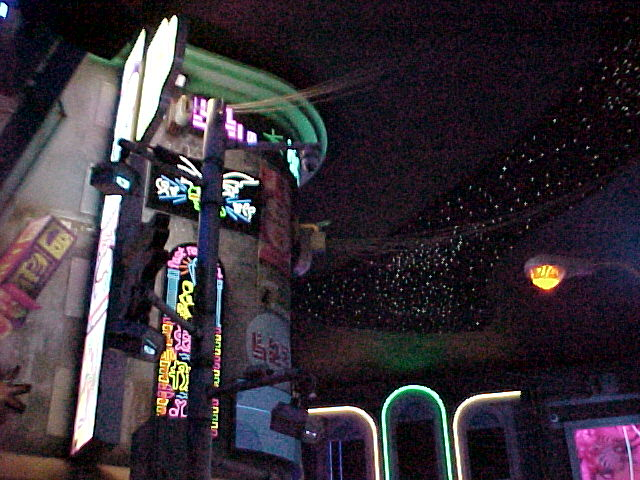

If you're reading this then that means I've successfully uploaded & setup this blog. I'm currently writing this about 30 minutes into the process. So far, I'm liking a lot of what 11ty has to offer, and the <a href="https://github.com/11ty/eleventy-base-blog">base-blog template</a> is such a great starting point. 

So far, CSS changes are where I'm spending the majority of my time. But ideally I only need to do this once! Custom woff2 font passthrough gave me a bit of trouble. Apparently <code>fonts/font-file.woff2</code> behaves differently than <code>/fonts/font-file.woff2</code> ... with the former acting more like a relative path based on the page. So my index (at the same directory level as fonts) was working just fine, but my about page did not since it was looking in <code>/about/fonts/</code> instead!

Ultimately I'm pleased with how quickly I could get this up and running. To test out some of the image capabilities I'm including a photo I took at Meow Wolf in Denver with my Sony Mavica MVC-FD73. That might have been one of the nerdiest sentences I've ever written.

