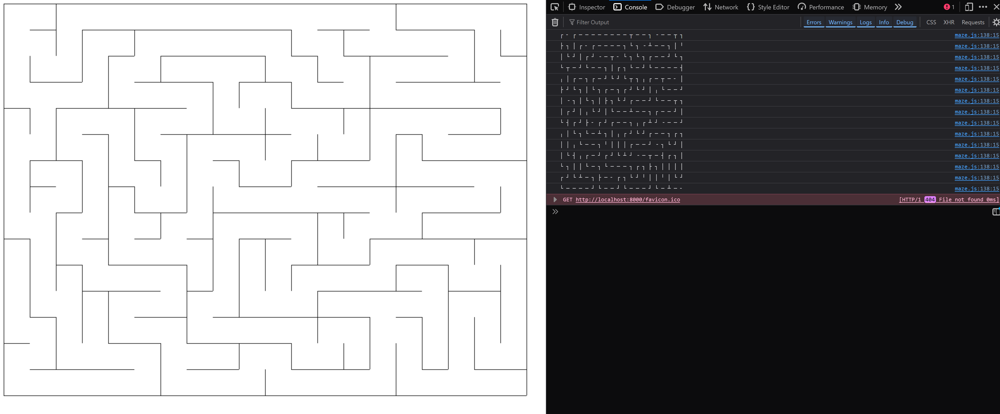
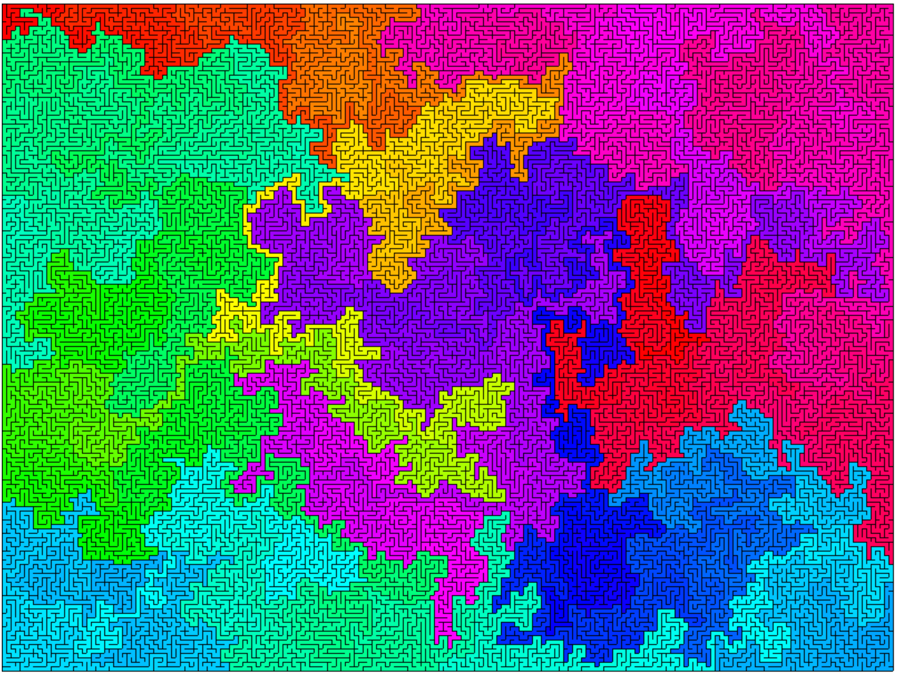
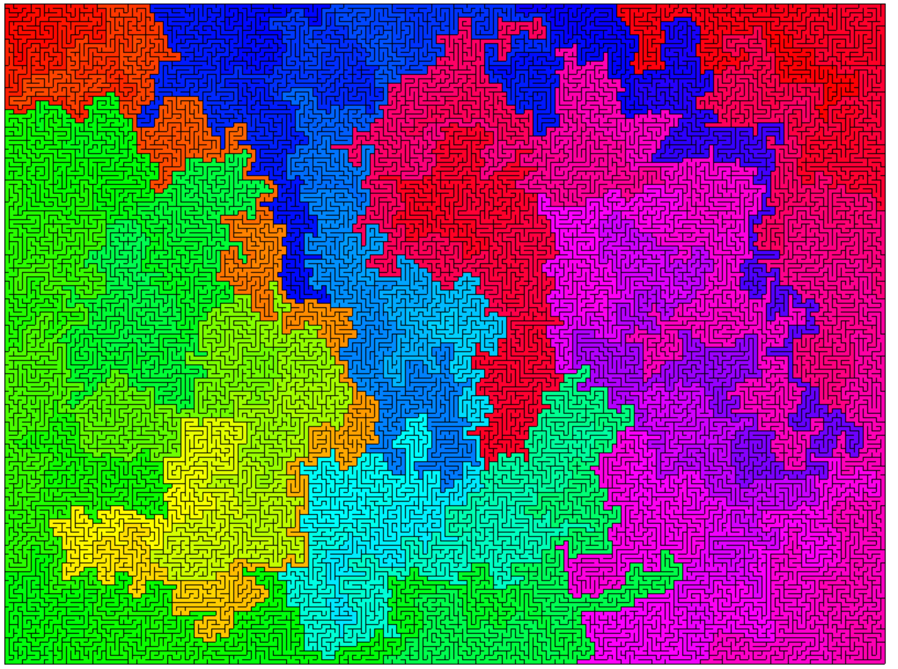
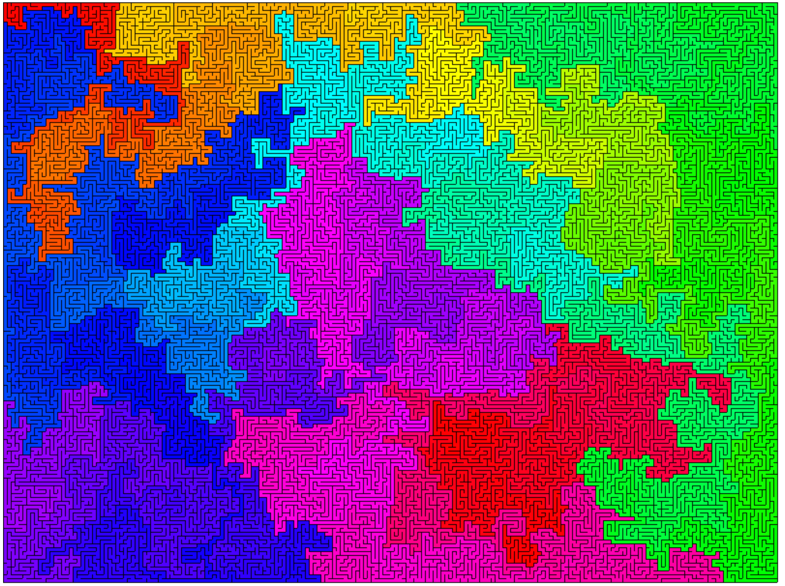
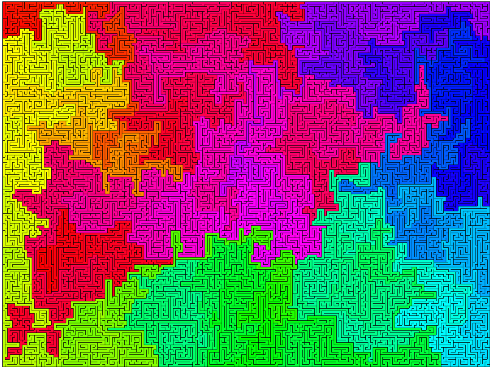
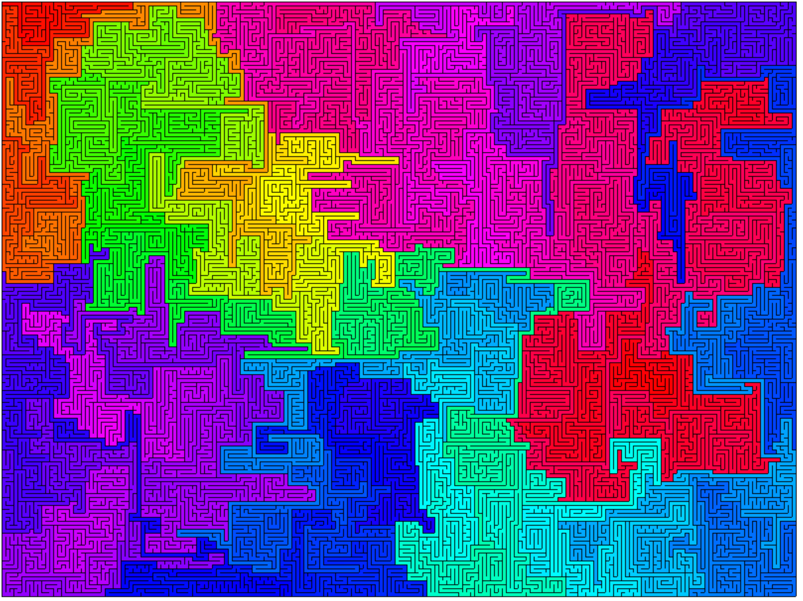
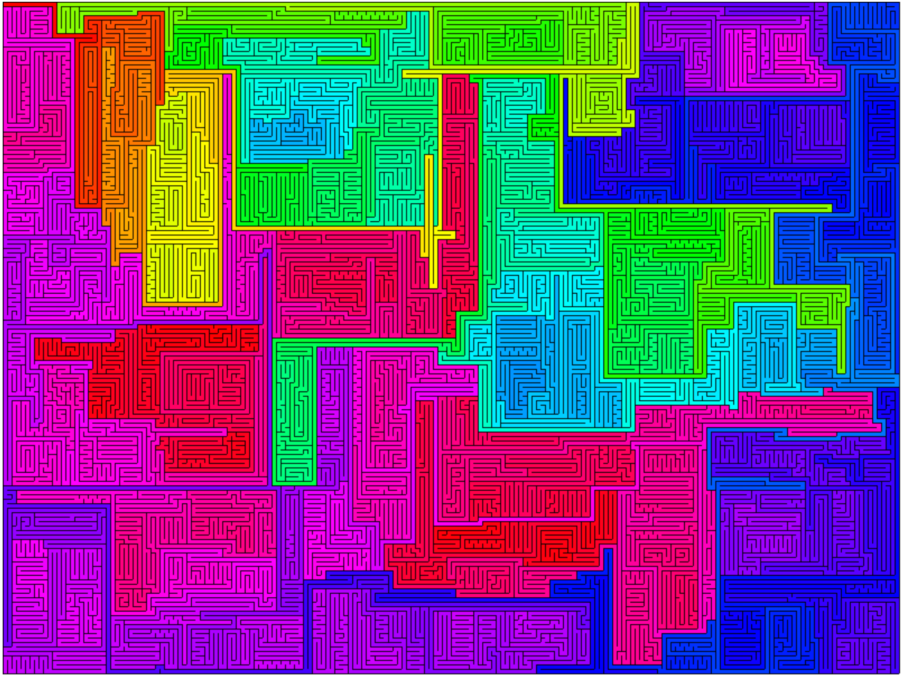
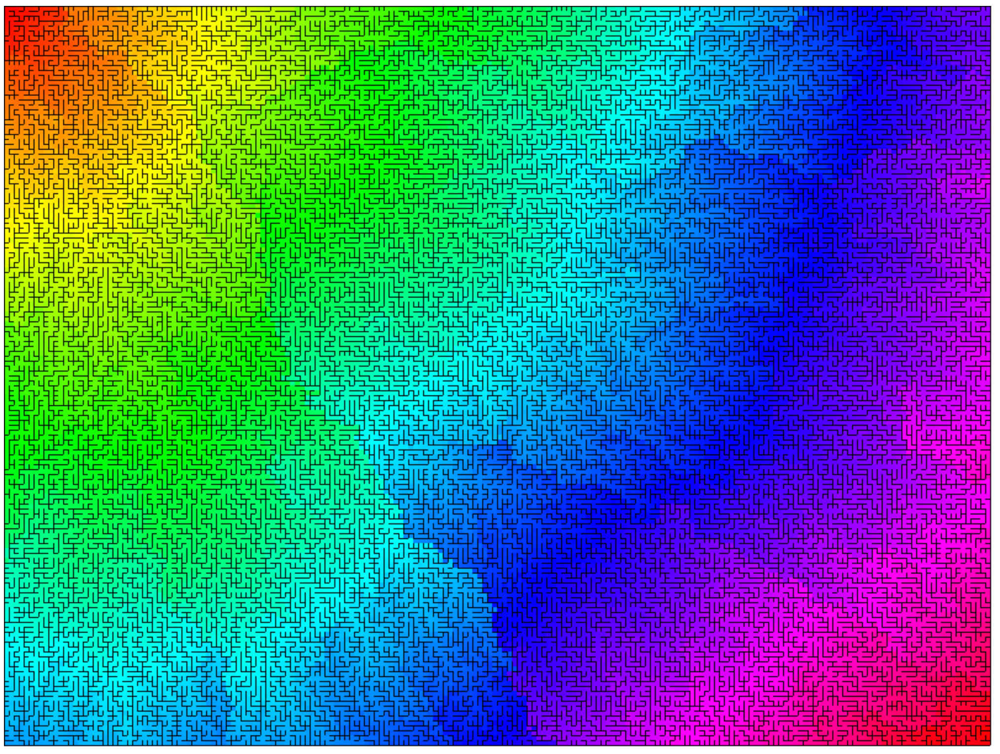
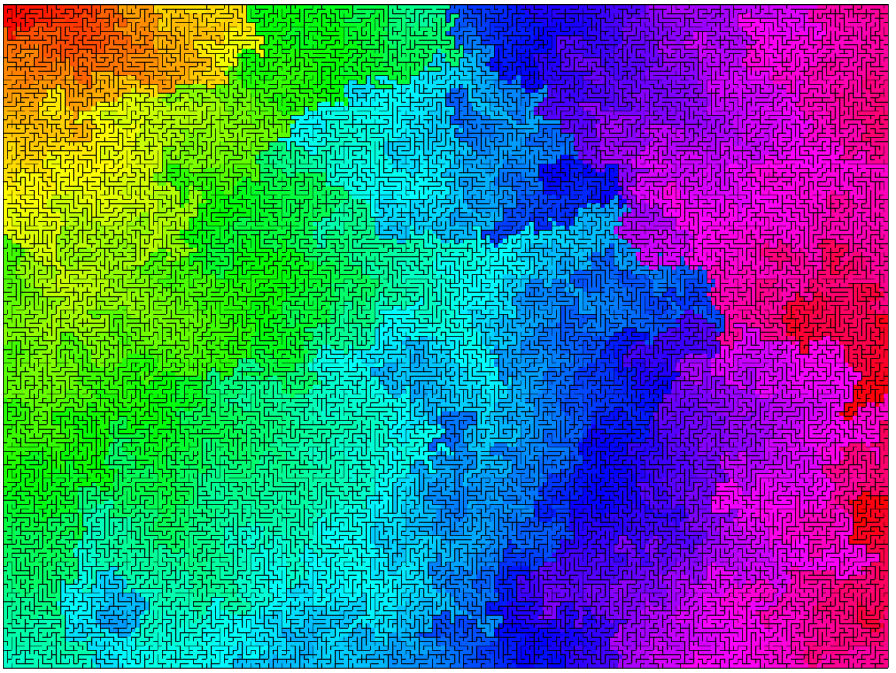
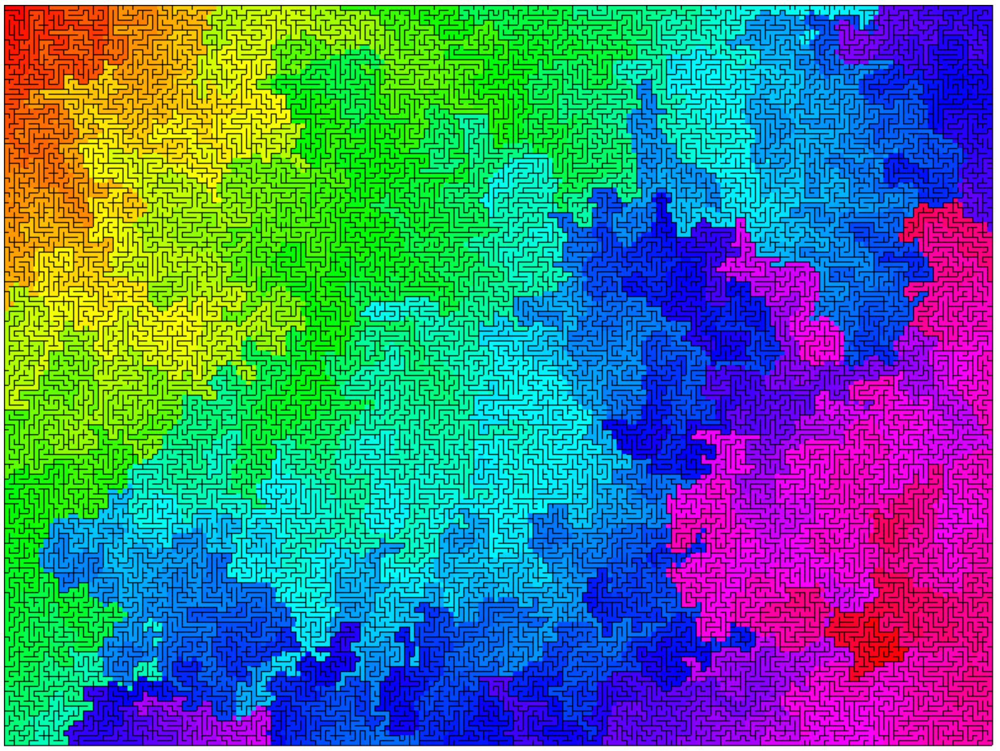

Over 6 or 7 years ago I found this piece at a thrift store. It was a bit scuffed but I loved it and bought it right away. I still have it on my wall to this day.


It looks like a generated maze, colored in some way that shifts hue based on travel time. If we start at the top left, with red, the color shifts towards yellow, green, etc. the more steps we take from our start position. So, how can we recreate this?

### The code

First step, I had to learn a bit about maze generation algorithms. I chose to represent my maze as a grid of Cells, where each Cell stores data about all 4 of its walls and its visited state. Here I use bitwise operations to store the wall information in the first 4 bits of an integer. Maybe a little overkill, but I just think bit flags are neat!
```js
const d_UP = 1;
const d_DOWN = 2;
const d_LEFT = 4;
const d_RIGHT = 8;

class Cell {
  constructor() {
    this.walls = 0;
    this.visited = false;
  }
  removeWall(direction) {
    this.walls = this.walls | direction;
  }
  hasWall(direction) {
    return (this.walls & direction) == 0;
  }
}
```

Then, I setup the Maze object with an array to hold all its Cells:
```js
class Maze {
  constructor(width, height) {
    this.width = width;
    this.height = height;
    this.grid = [];
    // populate grid with empty Cells
    for (let y = 0; y < this.height; y++) {
      const row = [];
      for (let x = 0; x < this.width; x++) {
        row.push(new Cell());
      }
      grid.push(row);
    }
  }

  // Check if a cell is within grid bounds
  isInBounds(x, y) {
    return x >= 0 && x < this.width && y >= 0 && y < this.height;
  }
  ...
}
```
Now to generate the maze. First I looked into this DFS (depth first search) style algorithm. After a few re-writes, rubber duck debugging, and plenty of tea, I got this working.
```js
class Maze {
    ...
    // DFS algorithm to generate the maze
    generate_dfs(start_x, start_y) {
        // Store history as an object that tracks current & previous position
        // as well as last direction for wall opening
        let stack = [];
        stack.push({
            x: start_x,
            y: start_y,
            last_x: null,
            last_y:null,
            last_dir: null,
        });
        // Continue looping until the stack is empty
        while(stack.length > 0){
            // Grab 
            let stackData = stack.pop();
            let [x, y] = [stackData.x, stackData.y];
            // Access this Cell object from our grid
            let nextCell = this.grid[y][x];
            
            // If we have a direction (intending to open a wall)
            // and our current cell has not been visited yet
            if(stackData.last_dir != null && !nextCell.visited){
                // Remove the wall pointing to the last cell (by flipping direction)
                nextCell.removeWall(flip_direction(stackData.last_dir));
                // Remove the wall from our last cell to this one
                this.grid[stackData.last_y][stackData.last_x].removeWall((stackData.last_dir));
            }
            // Now we mark the cell as visited
            nextCell.visited = true;;

            // randomize the DIRECTIONS array in-place
            shuffleArray(DIRECTIONS);

            // Now check all directions in a random order
            // Since it is a stack, the last direction checked will be first to pop on the next traversal
            for (let i = 0; i < DIRECTIONS.length; i++) {
                const dir = DIRECTIONS[i];
                // determine new coordinates:
                const new_x = x + (dir == d_LEFT ? -1 : (dir == d_RIGHT ? 1 : 0));
                const new_y = y + (dir == d_UP ? -1 : (dir == d_DOWN ? 1 : 0));
                
                // If this is a valid step (not out of bounds)
                // and this cell has not yet been visited...
                if (this.isInBounds(new_x, new_y) && !this.grid[new_y][new_x].visited) {
                    // push the new data on the stack to be traversed.
                    // Include last_dir so we can open the wall
                    stack.push({
                        x: new_x,
                        y: new_y,
                        last_x: x,
                        last_y: y,
                        last_dir: dir,
                    });
                }
            }
        }
        // While loop ends here, stack is empty so maze should be complete
    }
    ...
}
```
With some quick debug code to print the maze state to the console, and some canvas code to draw some lines on the page, I had some mazes on my screen at last:



### Generating mazes

To bring in the color, I added some additional information to each Cell: another integer to store its distance to the start. Once the maze was generated, I could color each cell based on that stored distance, and mapped it to once hue cycle. Here's an attempt on a 200x150 maze:



It works! But it looks quite a bit different than the original art. There are some thin, windy sections of a single color sandwiched between other colors. It almost looks a bit like a coastline-- chaotic but still has some structure. It looks cool but I think there's still plenty of improvement to be made. The original art doesn't have any thin, windy paths and somehow looks "softer".

My first idea was to change the maze generation in some way. Each time it traverses through the stack it shuffles the direction array, and I believe it "forces" the algorithm to take much more chaotic lines through empty space. If we shuffle the direction array less, then it would "prefer" to take more straight paths through empty space, and could influence the overall shape it generates. That was my theory, anyway. With these code changes:
```js
class Maze {
    ...
    // DFS algorithm to generate the maze, with new bias to randomize direction
    generate_dfs(start_x, start_y, rand_dir_bias) {
        ...
        // randomize directions, but with a bias to stay the same direction
        if(Math.random() < rand_dir_bias)
            shuffleArray(DIRECTIONS);
        ...
    }
    ...
```
I now experimented with different biases. Here's 5 attempts, with biases of 0.9, 0.7, 0.5, 0.3, and 0.1 in that order.







They all look quite cool, but were not exactly what I was hoping for. I think the 70% bias looks best, but there's still a fair number of thin, windy passages in every case. I think we can do a lot better.

This time I wanted to try other algorithms and liked <a href="https://en.wikipedia.org/wiki/Maze_generation_algorithm#Iterative_randomized_Kruskal's_algorithm_(with_sets)">this one</a>, a randomized version of Prim's algorithm.

```js
    // Iterative randomized Prim's algorithm 
    generate_prim(start_x, start_y) {
        // Step 1 already complete, all cells walled off
        let wall_list = [];
        // Step 2: pick a cell, mark it as part of the maze
        let startCell = this.grid[start_y][start_x];
        startCell.visited = true;
        // Step 2: Add the walls of the cell to the wall list
        for (let i = 0; i < DIRECTIONS.length; i++) {
            const dir = DIRECTIONS[i];
            const nx = start_x + (dir == d_LEFT ? -1 : (dir == d_RIGHT ? 1 : 0));
            const ny = start_y + (dir == d_UP ? -1 : (dir == d_DOWN ? 1 : 0));
            if (this.isInBounds(nx, ny)){
                // A wall entry is stored as coordinates and direction
                wall_list.push({x: start_x, y: start_y, dir: dir});
            }
        }

        // Step 3: While there are walls in the list
        while(wall_list.length > 0){
            // Step 3.1: Pick a random wall from the list
            shuffleArray(wall_list);
            let currentWall = wall_list.pop();
            // calculate the other cell this wall is connecting
            const wx = currentWall.x +
                (currentWall.dir == d_LEFT ? -1 : (currentWall.dir == d_RIGHT ? 1 : 0));
            const wy = currentWall.y +
                (currentWall.dir == d_UP ? -1 : (currentWall.dir == d_DOWN ? 1 : 0));
            let nextCell = this.grid[wy][wx];
            // Step 3.1: if only one of the cells the wall divides is visited
            // + is this cell valid?
            if(this.isInBounds(wx, wy) && !this.grid[wy][wx].visited) {
                // Step 3.1.1: Make the wall a passage and
                // mark the unvisited cell as part of the maze
                this.grid[currentWall.y][currentWall.x].removeWall((currentWall.dir));
                this.grid[wy][wx].removeWall(flip_direction(currentWall.dir));
                this.grid[wy][wx].visited = true;

                // Step 3.1.2: Add the neighboring walls of the cell to the wall list
                for (let i = 0; i < DIRECTIONS.length; i++) {
                    const dir = DIRECTIONS[i];
                    const new_x = wx + (dir == d_LEFT ? -1 : (dir == d_RIGHT ? 1 : 0));
                    const new_y = wy + (dir == d_UP ? -1 : (dir == d_DOWN ? 1 : 0));
                    // check if this new wall is valid
                    if (this.isInBounds(new_x, new_y) && !this.grid[new_y][new_x].visited){
                        wall_list.push({x: wx, y: wy, dir: dir});
                    }
                }
            }
        }
    }
```

After getting this new generation function up and running, I was curious to see how it differed than the DFS method. So I generated and...



Wow! This coloring looks so smooth it really resembles a radial gradient. My best guess to explain it is that Prim's algorithm calculates the minimum spanning tree of a graph, so it "discourages" the long, windy paths that DFS always seems to make. This maze just looks efficient. So I had some ideas on how to change it:

My current theory was that choosing a random wall each step would give the walls closer to the starting point more weight. This felt like the opposite of DFS, where walls closest to the starting point were selected only after all other options were exhausted. So wait, was this Prim's algorithm more like BFS? One <code>.pop();</code> into a <code>.shift();</code> later to test this theory and...


Whoops! I think BFS needs way more memory in this specific use case. I'll have to solve this mystery later. I have one last idea: modifying Prim's algorithm to change how often it shuffles the wall array.

```js
...
  // Iterative randomized Prim's algorithm (without stack, without sets)
  generate_prim(start_x, start_y, shuffle_chance) {
    ...
    if(Math.random() < shuffle_chance)
        shuffleArray(wall_list);
    ...
  }
...
```
With a 10% chance to shuffle, I got some interesting results:


It still retains some of that radial gradient pattern, but is a lot rougher. Maybe this is the right track! Here's another attempt with 2.5% chance to shuffle:



Not bad! This is the closest attempt so far, in my opinion. Still not quite on the mark, but wait-- my coloring algorithm has some bugs. It looks like some colors bleed outward through walls! There's still so much work to be done.

### What next?

This post is already plenty long, so I'll continue things with a part 2. Here's where I'm planning to take this project:

- Add different generation algorithms
- Animate the generation process, from walls to coloring
- Put this online with my other webtoys for people to play with

A huge thank you to whoever made this rainbow maze art and had it printed on a canvas so it exists in the physical world. I'm pretty happy it made its way to my walls and brought me plenty of inspiration.
